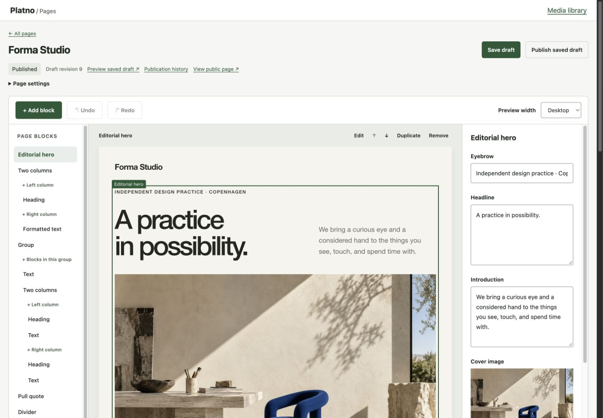

<div align="center">

# Platno

### From blank to published.

An extensible visual page editor for Laravel.<br>
Compose with blocks. Make it yours with PHP and Blade. Publish without a frontend build.

**Experimental Preview**

[](https://github.com/gogoSpace/laravel-platno/actions/workflows/checks.yml)

[Try the live demo](https://platno.gogospace.cz) · [Quick start](#quick-start) · [Build a plugin](docs/plugins.md) · [Framework integrations](examples/adapters/README.md)

</div>

> **Early software, real pages.** This is a pre-alpha experimental preview, not a beta or a production-ready release. APIs, plugin contracts and content formats may change. Use disposable projects and content while exploring it. [Current capabilities and limits →](docs/compatibility.md)



*The real editor, shown with the demo application's custom hero block and visual theme. Templates and artwork belong to the demo; the editing workspace belongs to this package.*

## Your content. Your Laravel application.

Platno turns a clean Laravel application into a place to compose and publish pages. It includes a visual editor, a media library and a Blade renderer. Your application keeps control of access, routes, storage and design.

- **Edit the page you see.** The canvas renders your actual Blade widgets. Edit headings and plain text in place; use the inspector for formatted text and other block settings.
- **Build with blocks.** Nest groups and columns, reorder with a pointer or keyboard, duplicate sections, and undo or redo document edits.
- **Publish deliberately.** Private drafts, separate published snapshots, history restoration and revision conflict detection protect your work.
- **Bring your own ideas.** A custom widget needs a PHP class, a Blade view and declarative fields. Its inspector works without writing JavaScript.
- **Keep the stack small.** No required Node build, frontend framework, UI library, Redis, queue worker or hosted service. Public pages work without JavaScript.

Included blocks: **text · headings · formatted text · links/buttons · images · files · groups · two columns · dividers**.

## Try it before installing

[**Open the live playground →**](https://platno.gogospace.cz)

The [playground](https://github.com/gogoSpace/platno-demo) is a separate Laravel application using this package. Its showcase content, visitor isolation and temporary page lifecycle belong to that application. The page editor, blocks, media handling and publication behavior belong to Platno.

| In the package | In the demo application |
| --- | --- |
| Page list, editor, canvas and inspectors | Showcase website and starter content |
| Drafts, publications and history | A separate temporary workspace per visitor |
| Media storage and reference tracking | Visitor expiry, quotas and cleanup |
| Plugin API and Blade output | Demo-specific templates and visual identity |
| Optional integration examples | Framework demonstration screens |

Installing Platno does **not** install the demo, expire your pages, or introduce a login system.

## Quick start

Requirements: **PHP 8.3+**, **Laravel 12 or 13**, Composer, and Laravel's normal database/session/cache setup. SQLite is the database verified so far. See the [compatibility details](docs/compatibility.md).

Platno is not on Packagist yet. Install the source checkout into a fresh local application:

```bash
git clone https://github.com/gogoSpace/laravel-platno.git
composer create-project laravel/laravel my-platno-site '^13.0' --no-dev
cd my-platno-site
composer config repositories.platno path ../laravel-platno
composer require 'platno/laravel:dev-main' --update-no-dev
php artisan platno:install --no-interaction
```

For Laravel 12, use `'^12.0'` in the first command. A normal fresh Laravel installation supplies the application key, SQLite database and session/cache tables. Installing into an existing application assumes those are already configured.

Add these mounts to `routes/web.php` for this **local playground**:

```php
use Platno\Platno;

if (app()->environment('local')) {
    Platno::editorRoutes();
}

Platno::publicRoutes();
```

Start the application on loopback:

```bash
php artisan serve --host=127.0.0.1 --port=8000
```

Open **[localhost:8000/platno](http://127.0.0.1:8000/platno)**. Create a page, add a heading and text, **Save draft**, then **Publish saved draft**. Your page is available at `/pages/your-address`.

That is the whole local path. No user, password, access key, `npm install` or asset build is needed.

The installer runs only package migrations and creates missing package configuration. It does not change your routes, authentication, environment, existing configuration or pending application migrations. [Installation and first publication in detail →](docs/first-publication.md)

### Access belongs to your application

The local example above deliberately exposes the editor only when `APP_ENV=local`; the server binds to your own computer. **A bare editor route mount permits access to everyone who can reach it.** In a hosted application, mount editor routes inside your own access middleware:

```php
use Illuminate\Support\Facades\Route;
use Platno\Platno;

Route::middleware(['auth', \App\Http\Middleware\CanEditContent::class])
    ->group(function (): void {
        Platno::editorRoutes();
    });

Platno::publicRoutes();
```

`auth` and `CanEditContent` are supplied by **your application**, not Platno. Choose your own access policy. Every editor endpoint—including media, previews and mutations—inherits the route group. Platno provides validation, CSRF protection and revision checks; it has no login, users, passwords, access keys, roles or guards.

## Your first custom widget

Generate a working plugin in the consuming Laravel application:

```bash
php artisan platno:make-plugin Callout --type=custom.callout
```

It creates `app/Platno/Callout.php` and `resources/views/platno-custom/callout.blade.php`. Add the generated class to the **existing** `plugins` array in `config/platno.php`:

```php
\App\Platno\Callout::class,
```

Keep the built-ins you want: the configured list replaces the defaults. If configuration is cached, rebuild it with `php artisan config:cache`. Reopen the editor and add **Callout**. Its text field, validation and escaped Blade output already work.

From there, add fields for URLs, selections, numbers, nested blocks or media. The same PHP/Blade plugin works in the default editor and every integration. [Complete custom plugin example →](docs/plugins.md)

## Vue, React and Livewire

Optional [adapter examples](examples/adapters/README.md) mount the **same native JavaScript editor directly in your application**, isolated with Shadow DOM. No iframe. No PrimeVue. The host supplies its existing framework.

```jsx
<PlatnoEditor
    editorAddress="/platno/pages/42/edit"
    onChange={({ dirty }) => setHasUnsavedChanges(dirty)}
/>
```

These are source examples to copy, not published npm packages. They manage mounting, disposal and events; they are not independent framework-specific editors or public renderers. The current editor works with **Platno pages**. Binding it as a generic form field for an arbitrary Eloquent model is not implemented.

## Make it fit

- **Routes:** choose editor/public prefixes when mounting; keep your host middleware.
- **Plugins:** register the built-ins and application-specific widgets you need.
- **Design:** configure theme tokens or override namespaced Blade views and shared plugin styles.
- **Media:** use the private default disk or configure a Laravel disk; originals retain their bytes.
- **Language:** override Laravel's namespaced `platno::editor` translations.

[Routing, design and storage →](docs/customization.md) · [How it works →](docs/architecture.md)

## What to expect from this preview

**Available:** visual composition, structured rich text, images/PDFs, private drafts, saved previews, immutable publication snapshots, history restoration, archive/recovery, custom plugins and direct framework integrations.

**Important limits:** canvas updates use a server round trip; incomplete required fields keep the last valid preview. Only built-in text/headings are directly editable on the canvas. Plugin styling must reach the shared public style view. Only SQLite and the local storage disk have been exercised. API and document compatibility are provisional.

**Not implemented:** raw HTML import, collaborative editing, automatic plugin-data migrations, arbitrary-model field binding, image cropping/derivatives, or permanent page/history deletion. There is no production-readiness claim.

[Verification and known limits →](docs/compatibility.md)

## Contribute

Helpful contributions reproduce a problem, improve the authoring experience, or make installation and extension clearer. See [CONTRIBUTING.md](CONTRIBUTING.md) for the workflow and focused test policy.

```bash
composer install
composer check
node --experimental-default-type=module --test tests/editor_store.test.mjs tests/adapter_bridge.test.mjs
```

PHPUnit/Testbench, Pint and Node checks are **development tools**, not consumer requirements. Fresh-consumer checks and isolation rules are documented in [development tooling](docs/tooling.md).

Report vulnerabilities privately using the instructions in [SECURITY.md](SECURITY.md).

## License

[MIT](LICENSE). Built for Laravel; independently maintained, with no affiliation implied.
