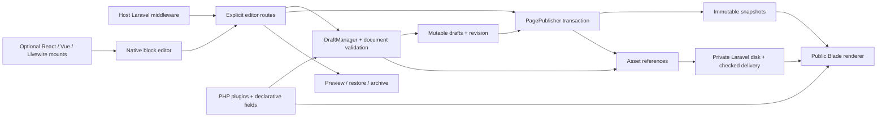

# Architecture

## Product and installation

Platno is a standalone Laravel package. Its implemented path is install → mount routes → compose a private draft → publish → visit anonymously. The default editor uses Blade, native JavaScript modules and scoped CSS. Composer installs only the Laravel components used by the package. Consumers need no Node, frontend framework, Redis, worker or external service for basic publishing.

The service provider registers configuration, views, translations, container bindings, a namespaced private disk definition and commands. It does not mount routes, query the database, run migrations, create files or alter host authentication. `platno:install` explicitly runs only package migrations and creates missing configuration without overwriting host files. Configuration and route caches are supported. Run installation sequentially.

## Implemented boundaries

The optional adapters mount the shared editor DOM directly into a host container, isolated by Shadow DOM. They do not use frames. Their framework dependencies belong to the host and never enter the base package. The canvas uses server-rendered plugin views; public rendering remains framework-independent.

## Host-owned access

The consuming application owns every authentication and authorization decision. Platno has no login/logout, users, passwords, access keys, guard, roles, fixed Gate or optional authentication mode. The host explicitly calls `Platno::editorRoutes()` inside its own middleware/policy group. Every editor route inherits that group, including JavaScript modules, media, previews and mutations. A bare mount is open to whoever can reach it; the package does not infer access rules.

Platno adds Laravel web CSRF, input validation, a request rate limit and editor response headers. It never changes global middleware or authentication settings. A local playground can use a loopback server. The public demo is a separate Laravel application responsible for isolating anonymous visitors and expiring their workspaces; that lifecycle is not part of this package. Fresh package installations create only content/media tables.

## Canonical content and editor

Version 1 documents contain an ordered block list. A block has a type, schema version, data and optional UUID. Plugin classes own defaults, validation and a Blade view; `EditablePlugin` adds declarative fields. The `Plugin` base derives common defaults/rules. Unknown keys, types and versions fail clearly, preserving stored data. No automatic schema migration is implemented.

The default inspector supports text, textarea, number, checkbox, select, safe links, nested blocks, structured rich text and assets. Nested content shares global limits of 100 blocks and six levels. Rich text is an explicit paragraph/list/run representation rendered through escaped Blade. It accepts no raw HTML and therefore needs no HTML parser or sanitizer. Trusted custom plugins remain responsible for their output.

The browser edits a complete document and submits it with an expected revision. JSON data is decoded without Laravel's global string trimming so canonical whitespace and empty values survive. A legacy one-text request remains accepted only for a compatible one-text document and only with an explicit `text` value. Missing content fails rather than clearing stored data. The composer preserves unedited data, regenerates subtree UUIDs on duplication, tracks unsaved changes and directs validation links into nested inspectors. A framework-independent document store owns mutations, nested movement and bounded undo/redo. Rendering, the outline, inspector, media controls and workspace lifecycle have separate modules. Without JavaScript, an explicit JSON textarea is available.

## Persistence and publication

`platno_pages` holds the stable unique slug, draft title/document, revision, nullable publication pointer and optional archive timestamp. `platno_publications` holds complete title/document/slug snapshots and source revisions. Publication models reject updates/deletes through Eloquent instance operations; direct bulk/database writes are outside this guarantee.

Draft saving and publication first perform a conditional revision update inside a transaction. A stale operation returns 409. Publication validates the complete saved document, creates a snapshot, records its asset references and moves the publication pointer atomically. Saving a draft never changes public output. Conflict responses preserve the submitted document for recovery and do not retry automatically.

History restore copies an owned snapshot to a new draft revision without publishing it. Unpublish clears the public pointer. Archive also removes the page from the active list and prevents saves/publication; unarchive retains the draft and requires an explicit publication. History and assets are retained. Permanent page/history deletion is not implemented.

## Routing and rendering

Editor and public routes are explicit separate mounts with dedicated, non-root configurable prefixes and names under `platno.*`. Namespace/name collisions fail clearly. Keep catch-all host routes after them; mount each group once without an enclosing route-name prefix. Public requests read only the current publication and check ownership. Draft and historical previews use editor routes and host middleware.

`POST /platno/canvas` validates the submitted document and renders its actual Blade views with editor-only block paths. It never saves content or asset references. Preview media uses private editor routes. A dedicated render rate limit does not consume the save/publication allowance. The client debounces requests, rejects outdated responses and preserves its data and last valid preview on validation/network failure. Stale structure and undo results become inert until current rendering is available.

`PageRenderer` validates the full document, delegates each block to `BlockRenderer`, and applies validated theme tokens. Public output is semantic Blade with no editor assets or required JavaScript. Unsupported public documents return 503; unsupported editor/preview documents return 422. Responses use `no-store`; there is no output caching layer to invalidate. Laravel namespaced view/translation overrides remain supported and the installer does not overwrite them.

## Assets and storage

Uploads accept JPEG, PNG, WebP and PDF with server-side MIME, size and image dimension checks. Generated keys and recorded Laravel disk names separate storage from user filenames. Originals are preserved; derivatives are not generated. The default disk is private and requires no storage symlink. Remote disks use host-owned drivers/configuration and have not been executed in this delivery.

An upload creates an `uploading` record before storage, then becomes `active` or `failed`. Selection uses active records only. Declared asset fields, including those inside nested block fields, create references from drafts and all retained publications. Reference updates share the owner's transaction. Deletion first reserves a non-uploading record, refuses retained references and then deletes storage. A failed deletion retains the record/key in `deleting` state for retry; failed uploads can also be removed. A process killed while uploading may leave an `uploading` record requiring host reconciliation after confirming that upload work has stopped. There is no automatic expiry job.

Editor media inherits host middleware. Anonymous media requires a reference from a current publication; retained history alone does not make an asset public. Unpublishing revokes subsequent anonymous requests while keeping history intact. Delivery uses validated MIME, `nosniff`, restrictive media CSP and attachment disposition for PDF. A request already in flight cannot be recalled.

## Extension and evidence

[Custom plugins](plugins.md) documents the generator, declarative schema, nested rendering and asset contracts. Theme tokens merge with defaults; plugin lists replace defaults. Optional [framework integrations](../examples/adapters/README.md) expose persisted metadata, unsaved document changes and errors through local browser events/callbacks. The workspace intercepts form submission, disables editing during a pending mutation and preserves content after failed saves. It removes `noscript` controls when importing the shell to avoid duplicate document fields. Unmounting aborts requests and listeners; the host handles SPA navigation confirmation.

[Compatibility](compatibility.md) records the executed verification scope and current limits. The repository workflow runs isolated package and fresh-consumer checks; a configured matrix is not proof of a passing remote run. Nothing is published to Packagist yet, and no production-readiness claim is made.
